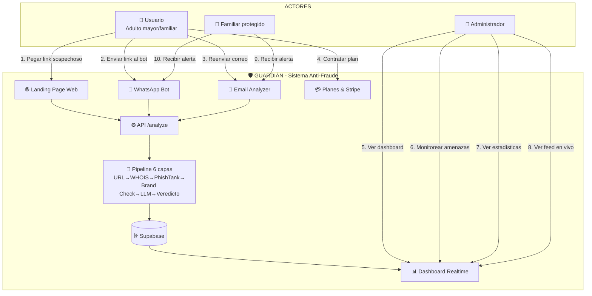

# Diagrama de Casos de Uso — Guardián Anti-Fraude Digital

## Sistema: 🛡️ Guardián



---

## Lista de Casos de Uso

| ID | Caso de Uso | Actor | Descripción | Prioridad |
|----|------------|-------|-------------|-----------|
| CU-01 | Analizar link vía web | Usuario | Pega URL sospechosa en la landing page, recibe veredicto 🟢🟡🔴 | Alta |
| CU-02 | Analizar link vía WhatsApp | Usuario | Envía URL al bot de WhatsApp, recibe análisis automático | Alta |
| CU-03 | Analizar correo phishing | Usuario | Reenvía email sospechoso a Guardián, analiza contenido y links | Alta |
| CU-04 | Ver dashboard en tiempo real | Admin | Monitorea KPIs, feed en vivo, gráficos de actividad | Media |
| CU-05 | Gestionar suscripción | Usuario | Elige plan (mensual/trimestral/anual), paga con Stripe | Media |
| CU-06 | Recibir alerta de fraude | Familiar | Guardián detecta amenaza y notifica proactivamente | Alta |
| CU-07 | Ver feed de análisis | Admin | Timeline cronológica de todos los análisis realizados | Media |
| CU-08 | Ver estadísticas y tendencias | Admin | Gráficos: veredictos, canales, marcas suplantadas, actividad 24h | Media |
| CU-09 | Ver detalle de amenaza | Admin | Score, señales, análisis LLM, tipo de ataque | Baja |
| CU-10 | Filtrar amenazas por tipo/canal | Admin | Filtros en dashboard para análisis segmentado | Baja |

---

## Pipeline de Análisis (6 Capas)

```
URL/Email → [1. Resolver URL] → [2. WHOIS] → [3. PhishTank]
         → [4. Brand Check MX] → [5. LLM DeepSeek/Groq]
         → [6. Fusión Score + LLM] → Veredicto
```

### Veredictos posibles

| Veredicto | Score | Descripción |
|-----------|-------|-------------|
| 🟢 SEGURO | 0-24 | Sin señales de fraude |
| 🟡 SOSPECHOSO | 25-64 | Señales de alerta, requiere precaución |
| 🔴 ESTAFA | 65-100 | Fraude confirmado |

### Canales de entrada

```
┌──────────┐    ┌──────────┐    ┌──────────┐
│  🌐 Web  │    │ 💬 WhatsApp│   │ 📧 Email │
│Landing pg│    │  Baileys │   │Gmail Pub│
└────┬─────┘    └────┬─────┘    └────┬─────┘
     └───────────────┬┴───────────────┘
                     ▼
            ┌────────────────┐
            │  POST /api/analyze │
            └────────────────┘
```
