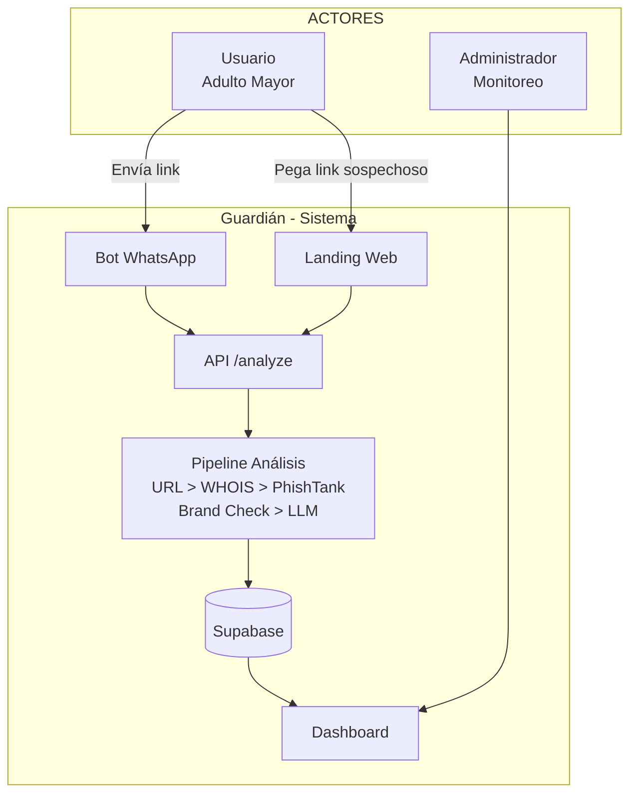

# Guardián
## Sistema Anti-Fraude Digital para Adultos Mayores en México

Documento de proyecto — Diseño de Software  
Julio 2026

---

## Contenido

1. [Investigación de Mercado](#1-investigación-de-mercado)
2. [Análisis de Competencia](#2-análisis-de-competencia)
3. [Diagrama de Casos de Uso](#3-diagrama-de-casos-de-uso)
4. [Protopersonas](#4-protopersonas)
5. [Estrategia de Investigación](#5-estrategia-de-investigación)
6. [Wireframes](#6-wireframes)
7. [Diseño Visual](#7-diseño-visual)
8. [Plan de Pruebas](#8-plan-de-pruebas)

---

# 1. Investigación de Mercado

## 1.1 El Problema

Las estafas digitales en México crecieron 38% anual. Los adultos mayores son el blanco principal: representan 23% de las víctimas pero concentran 42% del valor total perdido. La estafa promedio para este segmento es de 28,000 MXN, comparado con 8,000 MXN para la población general.

El canal principal de ataque es WhatsApp: 94% de los adultos mayores mexicanos usan WhatsApp como su única aplicación digital. Reciben links fraudulentos y no tienen forma confiable de verificar si son seguros.

## 1.2 Datos Clave

| Indicador | Valor | Fuente |
|---|---|---|
| Crecimiento fraudes digitales MX (2024-2025) | +38% | Condusef |
| Adultos mayores víctimas de fraude | 23% del total | INEGI |
| Valor total perdido por adultos mayores | 1,470 M MXN/año | Condusef |
| Adultos mayores que usan WhatsApp | 94% | IFT México |
| Phishing como tipo de fraude más común | 34% de incidentes | Kaspersky MX |
| Crecimiento del falso SAT vía WhatsApp | +160% en 2025 | SAT MX |
| Tasa de denuncia en adultos mayores | 12% | Encuesta Nacional Seguridad |

## 1.3 Tipos de Fraude más Comunes

| Tipo | Porcentaje | Descripción |
|---|---|---|
| Phishing (links falsos) | 34% | Enlaces que suplantan bancos, SAT, gobierno |
| Smishing (SMS) | 22% | Mensajes de texto con urgencia falsa |
| Vishing (llamadas) | 18% | Llamadas suplantando instituciones |
| Suplantación en redes | 12% | Perfiles falsos de familiares o empresas |
| Otros | 14% | Fraude en compras, inversiones falsas |

## 1.4 El Blanco: Adulto Mayor Mexicano

Perfil de la víctima típica:

- 65+ años
- Usa WhatsApp como única app
- Confía en autoridades (SAT, banco, gobierno)
- No distingue URLs legítimas de fraudulentas
- Tiene miedo a "problemas fiscales" o "multas"
- No denuncia por vergüenza o desconocimiento

Método de estafa #1: "Familiar en apuros" — mensaje de WhatsApp suplantando a un hijo o nieto pidiendo dinero urgente.

Método de estafa #2: "Falso SAT" — mensaje sobre devolución de impuestos, multas o requerimientos fiscales. Creció 160% en 2025.

## 1.5 Oportunidad de Mercado

| Dimensión | Hallazgo |
|---|---|
| Competidores directos en México | 0 (cero) |
| Herramientas que analicen links de WhatsApp | 0 (cero) |
| Soluciones preventivas (no reactivas) para MX | 0 (cero) |
| Productos con alertas a familiares | 0 (cero) |
| Adultos mayores en México | 18 millones |
| Pérdida anual por fraudes digitales | 3,500 M MXN |

Mercado virgen. Sin competencia directa. Oportunidad de ser el primero.

---

# 2. Análisis de Competencia

## 2.1 Mapa de Competidores

| Producto | Tipo | Precio | ¿Cubre México? | Enfoque |
|---|---|---|---|---|
| Trend Micro Check | App mobile + extensión | ~$30 USD/año | Global, sin localización | Anti-scam general |
| Guardio | Extensión Chrome | $9.99 USD/mes | Global, sin localización | Seguridad navegación |
| VirusTotal | Web + API | Gratis / API paga | Global | Análisis multi-engine |
| PhishTank | Base datos colaborativa | Gratis | Global | URLs phishing reportadas |
| Any.Run | Sandbox web | Gratis / $99/mes | Global | Análisis profundo malware |
| Bots Telegram genéricos | Bot Telegram | Gratis | Global | Verificación URLs |
| Herramientas oficiales MX | Ninguna interactiva | — | México | Solo informativas |

## 2.2 Tabla Comparativa Detallada

| Característica | Trend Micro | Guardio | VirusTotal | PhishTank | Cualquier Bot | Guardián |
|---|---|---|---|---|---|---|
| Análisis de URLs | Si | Si | Si | Si | Si | Si |
| Contexto México | No | No | No | No | No | Si |
| WhatsApp nativo | No | No | No | No | Si* | Si |
| Sin instalación | No | No | Si | Si | Si | Si |
| Dashboard en vivo | Si | Si | No | No | No | Si |
| Alertas a familiares | Si (Family Circle) | Si (familiar) | No | No | No | Si (planeado) |
| Gratuito | Parcial | No | Si | Si | Si | Si |
| Análisis por IA | Si | Si | No | No | No | Si |
| Marcas MX (SAT, BBVA) | No | No | No | No | No | Si |

\* Bots genéricos, sin contexto MX, sin dashboard, sin historial

## 2.3 Fortalezas y Debilidades de Competidores

### Trend Micro Check
- **Fortaleza**: Marca reconocida, ecosistema completo, Family Circle
- **Debilidad**: App pesada, requiere instalación, no entiende contexto mexicano, cara para el mercado MX

### Guardio
- **Fortaleza**: Escaneo proactivo, monitoreo multi-cuenta, buen UX
- **Debilidad**: Chrome-only, cara ($200+ MXN/mes), sin adaptación México

### VirusTotal
- **Fortaleza**: Multi-engine, API robusta, gratuita
- **Debilidad**: UX técnica, sin enfoque consumidor, rate limits, sin contexto MX

### PhishTank
- **Fortaleza**: Base de datos masiva, API gratuita, respaldo Cisco
- **Debilidad**: Solo lookup, sin análisis en tiempo real, sin features mobile

### Bots Telegram Genéricos
- **Fortaleza**: Gratis, rápidos, sin instalación
- **Debilidad**: Sin historial, sin dashboard, UX de comandos textuales

## 2.4 Gap de Mercado

Ningún competidor cubre simultáneamente:

1. **Contexto México** — entender SAT, Condusef, BBVA, Banamex, CFE
2. **WhatsApp nativo** — canal principal del adulto mayor mexicano
3. **Prevención + Dashboard** — no solo reaccionar, también monitorear
4. **Sin instalación** — bot, no app
5. **Gratuito** — accesible para el mercado mexicano

**Diferenciador central**: Guardián es el primer servicio anti-phishing diseñado específicamente para el ecosistema digital mexicano, accesible vía WhatsApp, gratuito, con inteligencia localizada.

---

# 3. Diagrama de Casos de Uso

## 3.1 Diagrama General



## 3.2 Tabla de Casos de Uso

| ID | Caso de Uso | Actor | Descripción | Prioridad |
|---|---|---|---|---|
| CU-01 | Analizar link vía web | Usuario | Ingresa URL en landing, recibe veredicto seguro/sospechoso/fraude | Alta |
| CU-02 | Analizar link vía WhatsApp | Usuario | Envía URL al bot de WhatsApp, recibe análisis automático | Alta |
| CU-03 | Ver dashboard en vivo | Administrador | Monitorea KPIs, feed de análisis, gráficos de actividad | Media |
| CU-04 | Ver feed de análisis | Administrador | Timeline de todos los análisis realizados con veredicto | Media |
| CU-05 | Ver detalle de amenaza | Administrador | Score, señales detectadas, análisis LLM, tipo de ataque | Baja |
| CU-06 | Filtrar análisis por tipo | Administrador | Filtra por veredicto, canal, marca, fecha | Baja |
| CU-07 | Ver estadísticas generales | Administrador | Total análisis, fraudes detectados, marcas suplantadas | Media |
| CU-08 | Recibir alerta de fraude | Usuario | Notificación proactiva cuando se detecta amenaza | Alta |

## 3.3 Pipeline de Análisis (6 Capas)

```
URL entrante
  │
  ├─ Capa 1: Resolver URL
  │    Detecta redirecciones, URL final, cadena completa
  │
  ├─ Capa 2: WHOIS
  │    Edad del dominio, registrador, fechas clave
  │
  ├─ Capa 3: PhishTank
  │    Verifica si URL está reportada como phishing
  │
  ├─ Capa 4: Brand Check MX
  │    Distancia Levenshtein con marcas mexicanas
  │    Detecta suplantación de SAT, BBVA, Banamex, etc.
  │
  ├─ Capa 5: LLM (DeepSeek / Groq)
  │    Análisis semántico del contenido de la página
  │    Detecta urgencia, solicitud de datos, lenguaje de estafa
  │
  └─ Capa 6: Fusión Score + LLM
       Combina señales técnicas (30%) con análisis IA (70%)
       Produce veredicto final
```

## 3.4 Veredictos

| Veredicto | Rango Score | Descripción | Acción Sugerida |
|---|---|---|---|
| Seguro | 0-24 | Sin señales de fraude | Navega con confianza |
| Sospechoso | 25-64 | Señales de alerta presentes | Verifica antes de ingresar datos |
| Fraude | 65-100 | Fraude confirmado | No ingreses ningún dato |

---

# 4. Protopersonas

## 4.1 Doña María — Usuaria Principal

**Perfil**

| Atributo | Detalle |
|---|---|
| Edad | 72 años |
| Ocupación | Jubilada, ama de casa |
| Residencia | CDMX, colonia popular |
| Educación | Secundaria completa |
| Tecnología | Smartphone básico, solo WhatsApp |
| Ingreso mensual | 6,000 MXN (pensión) |

**Comportamiento Digital**

- Usa WhatsApp 3+ horas al día
- Le escribe a sus hijos y nietos
- Recibe cadenas, promociones, mensajes de bancos/SAT
- No distingue URL legítima de falsa
- Entra a links que le llegan por mensaje
- Guarda contraseñas en un cuaderno

**Dolores**

- Miedo a "meterse en problemas con el SAT"
- Ha recibido mensajes de "devolución de impuestos"
- No sabe si un link es real o falso
- Sus hijos le advierten pero no le explican cómo identificar estafas
- Vergüenza de preguntar "lo básico" de tecnología

**Necesidades**

- Alguien o algo que le diga "esto es seguro" o "esto es peligroso"
- Proceso simple: recibe link, lo reenvía, recibe respuesta
- No quiere instalar apps complicadas
- Confía en recomendaciones de sus hijos

**Cita textual**

> "Mi hijo me dice 'no le hagas caso mamá', pero el mensaje se ve oficial. Tiene el logo del SAT y mi nombre. ¿Y si sí es verdad y pierdo mi devolución?"

## 4.2 Don Roberto — Usuario con Experiencia Media

**Perfil**

| Atributo | Detalle |
|---|---|
| Edad | 68 años |
| Ocupación | Contador jubilado |
| Residencia | Guadalajara, zona residencial |
| Educación | Universidad |
| Tecnología | Smartphone + laptop, usa apps bancarias |
| Ingreso mensual | 15,000 MXN (pensión + rentas) |

**Comportamiento Digital**

- Usa WhatsApp y Facebook
- Hace transferencias bancarias desde su app
- Revisa su estado de cuenta en línea
- Ha recibido intentos de phishing bancario
- Tiene cierta desconfianza pero no sabe verificar técnicamente

**Dolores**

- Ha recibido mensajes de "BBVA: tu tarjeta fue bloqueada"
- Entró a un link falso una vez, por suerte no puso datos
- Sabe que existen estafas pero no tiene herramienta para verificarlas
- Sus hijos viven en otro estado, no puede preguntarles siempre

**Necesidades**

- Herramienta rápida de verificación
- Poder compartir la herramienta con sus amigos jubilados
- Confirmación visual clara (verde/rojo)
- Explicación breve de por qué un link es peligroso

**Cita textual**

> "Sé que existen estafas, he visto en las noticias. Pero cuando el mensaje tiene el logo del banco y mi nombre exacto, dudo. Necesito algo que me confirme rápido."

## 4.3 Ana — Hija de Doña María (Cuidado Familiar)

**Perfil**

| Atributo | Detalle |
|---|---|
| Edad | 45 años |
| Ocupación | Contadora |
| Residencia | CDMX (vive en otra colonia) |
| Educación | Licenciatura |
| Tecnología | Smartphone, laptop, usa redes sociales |

**Comportamiento Digital**

- Habla con su mamá por WhatsApp todos los días
| Le ha explicado múltiples veces cómo identificar estafas
| Su mamá sigue cayendo en links falsos
| Trabaja tiempo completo, no puede estar monitoreando siempre

**Dolores**

| Frustración de no poder proteger a su mamá en tiempo real
| Su mamá no le cuenta cuando "casi cae" por vergüenza
| Ha tenido que ir a su casa a revisar mensajes
| Preocupación constante por el dinero de su mamá

**Necesidades**

| Recibir alertas si su mamá recibe un link fraudulento
| Poder ver el historial de análisis de su mamá
| Configurar protección sin que su mamá tenga que hacer nada
| Tranquilidad de saber que alguien está vigilando

**Cita textual**

> "Mi mamá me manda capturas de pantalla preguntando 'esto es verdad?'. Pero yo no siempre puedo contestar rápido. Necesito ayuda, no puedo estar 24/7."

## 4.4 Mapa de Actores vs Funcionalidades

| Funcionalidad | Doña María | Don Roberto | Ana |
|---|---|---|---|
| Enviar link para análisis | Via WhatsApp | Via WhatsApp o web | — |
| Recibir veredicto claro | Si | Si | — |
| Ver explicación | No necesita | Opcional | — |
| Dashboard de monitoreo | — | — | Si |
| Alertas en tiempo real | — | — | Si |
| Historial de análisis | No | Opcional | Si |
| Configuración protección | No | Si | Si |
| Recomendar a otros | No | Si | Si |

---

# 5. Estrategia de Investigación

## 5.1 Objetivos de Investigación

| Objetivo | Pregunta Principal | Método |
|---|---|---|
| Validar dolor | Los adultos mayores en México, reciben links fraudulentos por WhatsApp y no tienen cómo verificar? | Encuestas + entrevistas |
| Validar solución | Usarían un bot de WhatsApp que analice links? | Prototipo + prueba |
| Validar disposición a pagar | Pagarían 99 MXN/mes por protección familiar? | Encuesta de precios |
| Validar UX | El flujo "reenviar link > recibir resultado" es intuitivo? | Prueba de usabilidad |
| Validar precisión | El pipeline detecta correctamente fraudes mexicanos? | Prueba técnica con datos reales |

## 5.2 Métodos

| Método | Propósito | Participantes | Duración |
|---|---|---|---|
| Encuesta cuantitativa | Validar magnitud del problema | 200+ adultos mayores + familiares | 2 semanas |
| Entrevistas cualitativas | Entender contexto, emociones, barreras | 10-15 adultos mayores | 1 semana |
| Prueba de usabilidad | Validar flujo WhatsApp | 5-8 adultos mayores | 3 sesiones |
| Prueba A/B | Comparar diseño de resultados | 20+ usuarios | 1 semana |
| Análisis de logs | Validar precisión del detector | Datos de producción | Continuo |

## 5.3 Segmento de Usuarios para Pruebas

| Segmento | Descripción | Reclutamiento |
|---|---|---|
| Adulto mayor, bajo tech literacy | Similar a Doña María | Centros comunitarios, iglesias |
| Adulto mayor, tech media | Similar a Don Roberto | Grupos de jubilados, clubes |
| Familiar cuidador | Similar a Ana | Grupos de WhatsApp familiares |
| Usuario joven (control) | 25-40 años, tech savvy | Online |

## 5.4 Métricas Clave

| Métrica | Meta | Cómo se mide |
|---|---|---|
| Tasa de completitud de análisis | > 90% | Usuarios que envían link y ven resultado |
| Tiempo para entender veredicto | < 10 segundos | Prueba de usabilidad |
| Tasa de reenvío a familiares | > 30% | Tracking en dashboard |
| Satisfacción (CSAT) | > 4.0 / 5.0 | Encuesta post-análisis |
| Precisión del detector | > 95% | Validación manual de resultados |

## 5.5 Cronograma

| Fase | Actividad | Duración | Semanas |
|---|---|---|---|
| 1 | Encuesta cuantitativa | 2 semanas | 1-2 |
| 2 | Entrevistas cualitativas | 1 semana | 3 |
| 3 | Iteración de prototipo | 1 semana | 4 |
| 4 | Prueba de usabilidad | 1 semana | 5 |
| 5 | Ajustes finales | 1 semana | 6 |

---

# 6. Wireframes

## 6.1 Landing Page

```
+------------------------------------------------------------------+
| [Logo Guardián] [Funciona] [Dashboard]          [Probar ahora >] |
+------------------------------------------------------------------+
|                                                                    |
|  +--------------------------------------------------------------+ |
|  |                                                               | |
|  |           Guardián                                            | |
|  |           Anti-Fraude Digital                                 | |
|  |                                                               | |
|  |           Protege a tu familia de fraudes                     | |
|  |           en México. Analiza links sospechosos                | |
|  |           al instante.                                        | |
|  |                                                               | |
|  |  +--------------------------------------------------------+  | |
|  |  | [🔗]  Pega el link sospechoso aquí...                 [🔍]|  |
|  |  +--------------------------------------------------------+  | |
|  |                                                               | |
|  |  Analiza links de WhatsApp, SMS o correo en segundos          | |
|  |                                                               | |
|  +--------------------------------------------------------------+ |
|                                                                    |
|  3 pasos simples:                                                  |
|  +---------------+ +---------------+ +---------------+               |
|  | 01            | | 02            | | 03            |               |
|  | Pega el link  | | Analizamos    | | Recibe el     |               |
|  | sospechoso    | | al instante   | | veredicto     |               |
|  +---------------+ +---------------+ +---------------+               |
|                                                                    |
|  +--------------------------------------------------------------+ |
|  | Más de 1,247 análisis realizados |                            | |
|  +--------------------------------------------------------------+ |
|                                                                    |
+------------------------------------------------------------------+
| [Guardián] [Privacidad] [Términos]                                |
+------------------------------------------------------------------+
```

## 6.2 Pantalla de Resultado

```
+------------------------------------------------------------------+
| [Logo Guardián]                          [Nuevo Análisis]        |
+------------------------------------------------------------------+
|                                                                    |
|  Resultado del Análisis                                            |
|                                                                    |
|  +--------------------------------------------------------------+ |
|  |                                                               | |
|  |                    [Score Ring]                                | |
|  |                                                               | |
|  |                    72% Riesgo                                  | |
|  |                                                               | |
|  |              ESTAFA DETECTADA                                  | |
|  |                                                               | |
|  |  Link analizado:                                               | |
|  |  https://sats-gob-mx.devolucion-impuestos.com/ingresar         | |
|  |                                                               | |
|  |  Tipo de amenaza: Phishing                                     | |
|  |  Marca suplantada: SAT                                         | |
|  |                                                               | |
|  |  Este sitio suplanta al SAT. Solicita RFC y contraseña.       | |
|  |  Los sitios oficiales del SAT terminan en .gob.mx              | |
|  |                                                               | |
|  |  Recomendaciones:                                              | |
|  |  No ingreses ningún dato                                       | |
|  |  El SAT no pide información por WhatsApp                       | |
|  |  Reporta el número como spam                                   | |
|  |                                                               | |
|  +--------------------------------------------------------------+ |
|                                                                    |
+------------------------------------------------------------------+
```

## 6.3 Dashboard de Administración

```
+------------------------------------------------------------------+
| Dashboard Guardián                               [🔴 Tiempo real] |
+------------------------------------------------------------------+
|                                                                    |
|  +----------+ +----------+ +----------+ +----------+               |
|  | Total    | | Hoy       | | Fraudes  | | Protegidos|            |
|  | Análisis | |           | |          | |           |             |
|  | 1,247    | | 38        | | 12%      | | 847       |             |
|  +----------+ +----------+ +----------+ +----------+               |
|                                                                    |
|  +----------------------------+ +----------------+               |
|  | Actividad 24h              | | Veredictos     |               |
|  | [Barras de actividad]      | | [Donut chart]  |               |
|  |                            | | 🟢 Seguro 70%  |               |
|  |                            | | 🟡 Sospechoso  |               |
|  |                            | | 🔴 Fraude 12%  |               |
|  +----------------------------+ +----------------+               |
|                                                                    |
|  +----------------------------+ +----------------+               |
|  | Feed en Vivo               | | Marcas más     |               |
|  | [Timeline de análisis]     | | Suplantadas    |               |
|  | [Dominio] [Veredicto] [..] | | SAT 45         |               |
|  | [Dominio] [Veredicto] [..] | | BBVA 32       |               |
|  | ...                        | | Banamex 18     |               |
|  +----------------------------+ +----------------+               |
|                                                                    |
+------------------------------------------------------------------+
```

## 6.4 Flujo WhatsApp (Texto)

**Usuario**: Envía link al bot

```
[Usuario] > hola, este link es seguro?
        [link] https://bit.ly/3xK9mN2
```

**Bot**: Responde automáticamente

```
[Guardián] > 🔴 ESTAFA DETECTADA
  Score: 78/100
  Tipo: Phishing bancario
  Marca: BBVA

  Este sitio suplanta a BBVA.
  Los sitios oficiales terminan en bbva.mx

  Recomendaciones:
  - No ingreses ningún dato
  - BBVA no pide contraseñas por mensaje
  - Reporta el número como spam

  ¿Quieres saber más? Responde "detalles"
```

---

# 7. Diseño Visual

## 7.1 Paleta de Color

La paleta utiliza tonos slate y stone como base, con acentos sutiles para estados semánticos. Diseñada para ser profesional, accesible (WCAG AA+) y no depender de colores neón o modas pasajeras.

| Token | Hex | Uso |
|---|---|---|
| surface | #FAFAF9 | Fondo de página |
| surface-elevated | #F5F5F4 | Fondos de tarjetas |
| border | #E7E5E4 | Bordes y divisores |
| text-muted | #A8A29E | Texto secundario |
| text-primary | #292524 | Texto principal |
| accent | #6366F1 | Acento principal (indigo) |
| success | #16A34A | Veredicto seguro |
| warning | #D97706 | Veredicto sospechoso |
| danger | #DC2626 | Veredicto fraude |
| surface-dark | #1C1917 | Dashboard modo oscuro |
| surface-elevated-dark | #292524 | Tarjetas modo oscuro |
| border-dark | #44403C | Bordes modo oscuro |
| text-muted-dark | #A8A29E | Texto secundario oscuro |
| text-primary-dark | #FAFAF9 | Texto principal oscuro |

## 7.2 Tipografía

| Elemento | Fuente | Peso | Tamaño |
|---|---|---|---|
| Body | Inter | 400 | 16px |
| Headings | Inter | 600 | 24-48px |
| Código | JetBrains Mono | 400 | 14px |
| Etiquetas | Inter | 500 | 12px |
| Botones | Inter | 500 | 14px |

## 7.3 Componentes

### Tarjeta (Card)

```
+------------------------------------------------------------------+
| border: 1px solid #E7E5E4                                        |
| border-radius: 12px                                              |
| background: #F5F5F4                                              |
| padding: 24px                                                    |
| box-shadow: 0 1px 3px rgba(0,0,0,0.06)                          |
+------------------------------------------------------------------+
```

### Badge de Veredicto

```
[Seguro]     background: #F0FDF4    color: #166534    border: #BBF7D0
[Sospechoso] background: #FFFBEB    color: #92400E    border: #FDE68A
[Fraude]     background: #FEF2F2    color: #991B1B    border: #FECACA
```

### Botones

```
[Primario]   background: #6366F1    color: #FFFFFF    border-radius: 8px    padding: 10px 20px
[Secundario] background: transparent  color: #292524    border: 1px solid #E7E5E4
[Ghost]      background: transparent  color: #6366F1
```

### Tabla de Datos

| Propiedad | Valor |
|---|---|
| Encabezado | 12px, 600 weight, #A8A29E, uppercase, tracking 0.05em |
| Celdas | 14px, 400 weight, #292524 |
| Altura fila | 48px |
| Hover | background: #F5F5F4 |
| Borde inferior | 1px solid #E7E5E4 |
| Sin bordes verticales | — |

---

# 8. Plan de Pruebas

## 8.1 Tipos de Prueba

| Tipo | Alcance | Herramienta |
|---|---|---|
| Pruebas unitarias | Pipeline de análisis, scorers, validaciones | Vitest |
| Pruebas de integración | API /analyze, webhooks, Supabase | Supertest |
| Pruebas de usabilidad | Flujo WhatsApp y web con adultos mayores | Sesiones presenciales |
| Pruebas de accesibilidad | WCAG 2.2 AA | axe-core, Lighthouse |
| Pruebas de carga | API bajo 100 requests/minuto | k6 |
| Pruebas de seguridad | SQL injection, XSS, rate limiting | OWASP ZAP |

## 8.2 Escenarios de Prueba

### Pipeline de Análisis

| ID | Escenario | Entrada | Resultado Esperado |
|---|---|---|---|
| P-01 | URL legítima BBVA | https://www.bbva.mx | Seguro, score < 25 |
| P-02 | URL suplantando SAT | https://sats-gob-mx.com | Fraude, score > 65 |
| P-03 | URL acortada maliciosa | https://bit.ly/falso-sat | Fraude después de resolver |
| P-04 | URL con redirecciones | Múltiples redirecciones | Detecta cadena completa |
| P-05 | Dominio recién creado | < 7 días | Sospechoso/Fraude |
| P-06 | Marca similar (Levenshtein) | bbva-seguridad.mx | Sospechoso |

### WhatsApp Bot

| ID | Escenario | Acción | Resultado Esperado |
|---|---|---|---|
| W-01 | Enviar link legítimo | Usuario envía URL | Respuesta segura |
| W-02 | Enviar link fraudulento | Usuario envía URL | Respuesta alerta |
| W-03 | Enviar texto sin link | Usuario escribe "hola" | Respuesta amigable guiando |
| W-04 | Enviar múltiples links | Usuario envía 3 URLs seguidas | Análisis individual |
| W-05 | Enviar imagen con link | Usuario envía screenshot | (Futuro) OCR + análisis |

### Dashboard

| ID | Escenario | Acción | Resultado Esperado |
|---|---|---|---|
| D-01 | Carga inicial | Admin abre dashboard | KPIs, gráficos, feed cargan |
| D-02 | Llega nuevo análisis | Usuario analiza URL | Feed se actualiza en vivo |
| D-03 | Filtrar por veredicto | Admin selecciona "Fraude" | Solo fraudes visibles |
| D-04 | Ver detalle amenaza | Admin click en threat | Score, señales, explicación |

### Accesibilidad (WCAG 2.2 AA)

| ID | Criterio | Elemento | Verificación |
|---|---|---|---|
| A-01 | Contraste 4.5:1 | Texto body sobre fondo | Pass |
| A-02 | Contraste 3:1 | Texto grande sobre fondo | Pass |
| A-03 | Tamaño de target | Botones >= 44x44px | Pass |
| A-04 | Focus visible | Todos los elementos interactivos | Pass |
| A-05 | Navegación teclado | Tab order lógico | Pass |
| A-06 | Alt text | Imágenes e íconos | Pass |

## 8.3 Cobertura Esperada

| Capa | Cobertura Mínima |
|---|---|
| Funciones de scoring | 100% |
| Validaciones (Zod) | 100% |
| API routes | 90%+ |
| Componentes UI | 80%+ |
| Flujos críticos (analizar URL) | 100% |

---

> Documento generado para el proyecto Guardián — Julio 2026
